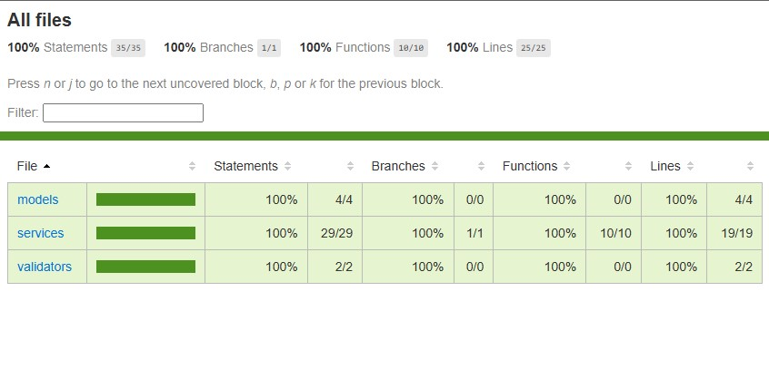

# API de Gerenciamento de Usuários

API REST desenvolvida em Node.js utilizando Express.js para gerenciamento de usuários. A API permite realizar operações de criação, leitura, atualização e exclusão de usuários.

---

## Funcionalidades

- **Cadastrar Usuários:** Permite adicionar novos usuários ao banco de dados.
- **Listar Todos os Usuários:** Retorna uma lista com todos os usuários cadastrados.
- **Obter Usuário por ID:** Retorna os dados de um usuário específico com base no ID.
- **Atualizar Usuário:** Atualiza as informações de um usuário utilizando o ID.
- **Excluir Usuário:** Remove um usuário do banco de dados utilizando o ID.

---

## Endpoints

### **Cadastrar Usuário**
- **URL:** `/users`
- **Método:** `POST`
- **Descrição:** Cria um novo usuário.
- **Exemplo de Corpo da Requisição:**
  ```json
  {
    "name": "João Silva",
    "email": "joao.silva@gmail.com",
    "password": "abc!Rdsfsaas@"
  }
  ```


---

### **Listar Todos os Usuários**
- **URL:** `/users`
- **Método:** `GET`
- **Descrição:** Retorna uma lista com todos os usuários.

---

### **Obter Usuário por ID**
- **URL:** `/users/:id`
- **Método:** `GET`
- **Descrição:** Retorna os dados de um usuário específico pelo ID.
- **Parâmetros:** `id` - ID do usuário a ser buscado.

---

### **Atualizar Usuário**
- **URL:** `/users/:id`
- **Método:** `PUT`
- **Descrição:** Atualiza os dados de um usuário específico pelo ID.
- **Exemplo de Corpo da Requisição:**
  ```json
    {
    "name": "João Ferreira da Silva",
    "email": "joao.silva@gmail.com",
    "password": "Nova!Senha$%@#"
    }
  ```

---

### **Excluir Usuário**
- **URL:** `/users/:id`
- **Método:** `DELETE`
- **Descrição:** Remove um usuário do banco de dados pelo ID.
- **Parâmetros:** `id` - ID do usuário a ser removido.

---

## Como Utilizar

### Pré-requisitos
- Node.js instalado (versão 14 ou superior).
- Gerenciador de pacotes npm ou yarn.

### Instalação
1. Clone este repositório:
   ```bash
   git clone https://github.com/Dudubor/ProjetoFinal.git
   ```
2. Acesse o diretório do projeto:
   ```bash
   cd seu-repositorio
   ```
3. Instale as dependências:
   ```bash
   npm install
   ```

### Execução
- **Modo de Desenvolvimento:**

   ``` npm run star:dev npm install```
   (rodar Typescript) ou ```npm run start``` (rodar JS).

 - **URL**: http://localhost:3000
 

---


## 🧪 Testes (Jest)

- Implementação e testes de integração do UserService. 

- Simula um banco de dados MongoDB em memória com o pacote mongodb-memory-server.

### Pré-requisitos (Testes)

- Jest

###### -  Certifique-se de ter o Node.js e o npm instalados.


---

## Principais Testes

**Criar Usuário:**
- Valida que o usuário é salvo corretamente no banco.
- Confirma que a senha é armazenada em formato hash.

**Validar Dados Inválidos:**
- Testa se o serviço rejeita dados inválidos, como e-mails mal formatados.


**Listar Usuários:**
- Verifica se a lista de usuários contém os dados esperados.

**Buscar por ID:**
- Valida se o serviço encontra o usuário correto pelo ID.

**Atualizar Usuário:**
- Confirma se os dados são atualizados corretamente.
- Garante que os campos antigos são substituídos pelos novos.

**Deletar Usuário:**
Testa se o usuário é removido corretamente do banco.

---

## Executar Testes

   ```bash
   npm run test
   ```

## Exemplo de Saída


## 🧪 Testes (Coverage)

## Executar Testes

   ```bash
   npx jest --coverage
   ```

   O comando irá executar os testes e gerar um relatório de cobertura, exibindo os resultados no terminal.

## Visualizar o Relatório

1. Após rodar o comando, um diretório chamado ``` coverage/``` será criado na raiz do projeto.


2. O relatório detalhado estará disponível no arquivo HTML dentro desse diretório:

  ```bash
    coverage/lcov-report/index.html
   ```

3. Abra o arquivo ```index.html``` no navegador para visualizar o relatório completo.

## Exemplo de Saída



## Contribuição

Sinta-se à vontade para contribuir com este projeto. Envie um pull request ou abra uma issue para discutirmos melhorias.